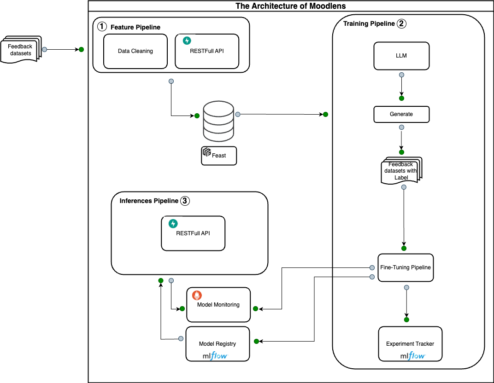

# nlp-hr-feedback

# I. Introduction
This project aims to revolutionize HR processes by leveraging advanced natural language processing (NLP) techniques to analyze employee feedback data. Our tool empowers HR departments to make data-driven decisions, optimize employee experiences, and foster a more productive work environment.
Key features include:
- Topic Modeling: Automatically identify recurring themes in employee feedback.
- Sentiment Analysis: Gauge the overall mood and satisfaction levels across the organization.
- Text Summarization: Condense large volumes of feedback into actionable insights.

## Model artitecture

