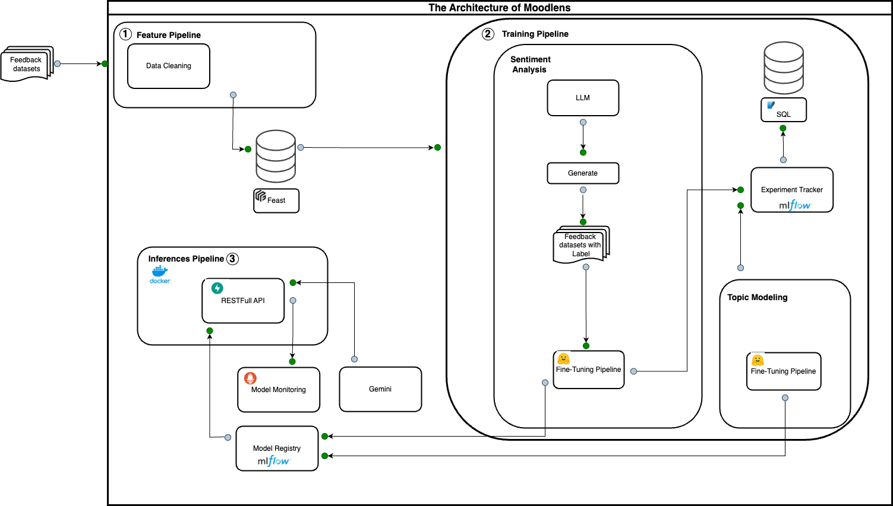

<!-- PROJECT LOGO -->
<br />
<p align="center">
  <a href="https://github.com/duongtrongchi/Moodlens">
    
  </a>

  <h3 align="center">Moodlens</h3>

  <p align="center">
    <a href="https://github.com/dao-duc-tung/inference-service-grpc-restful/issues">Report Bug</a>
    ·
    <a href="https://github.com/dao-duc-tung/inference-service-grpc-restful/issues">Request Feature</a>
  </p>
</p>

<!-- TABLE OF CONTENTS -->
<details open="open">
  <summary>Table of Contents</summary>
  <ol>
    <li><a href="#about-the-project">About The Project</a></li>
    <li><a href="#getting-started">Getting Started</a></li>
    <li><a href="#system-design">System Design</a></li>
    <li><a href="#license">License</a></li>
    <li><a href="#contact">Contact</a></li>
    <li><a href="#acknowledgements">Acknowledgements</a></li>
  </ol>
</details>

## About The Project
This project aims to revolutionize HR processes by leveraging advanced natural language processing (NLP) techniques to analyze employee feedback data. Our tool empowers HR departments to make data-driven decisions, optimize employee experiences, and foster a more productive work environment.

Key features include:
- Topic Modeling: Automatically identify recurring themes in employee feedback.
- Sentiment Analysis: Gauge the overall mood and satisfaction levels across the organization.
- Text Summarization: Condense large volumes of feedback into actionable insights.


## System Design


## Getting Started

### Quickstart

1. (Optional) Setup local dev environment

   - Create and activate a **Python 3.10** virtual environment by using `conda`, `venv`, or `pipenv`
   - Run

   ```bash
   pip install poetry
   ```

   ```
   poetry shell
   ```

2.1 To run training pipeline
  ```bash
   cd scripts

   bash run_bert_topic_training_pipeline.sh
  ```

2.2 To run inference pipeline
  ```bash
   cd scripts

   bash run_inference_pipeline.sh
  ```
2.3 To run feature pipeline ui
  ```bash
   cd scripts

   bash run_feature_pipeline_ui.sh
  ```


## Contributing

Contributions make the open source community such an amazing place to learn, inspire, and create. Any contributions you make are **greatly appreciated**.

1. Fork the Project
2. Create your Feature Branch (`git checkout -b feature/FeatureName`)
3. Commit your Changes (`git commit -m 'Add some FeatureName'`)
4. Push to the Branch (`git push origin feature/FeatureName`)
5. Open a Pull Request

## License

Distributed under the MIT License. See [LICENSE](LICENSE) for more information.

## Contact

Duong Trong Chi - [LinkedIn](https://www.linkedin.com/in/duongtrongchi/)

Project Link: [https://github.com/duongtrongchi/Moodlens](https://github.com/duongtrongchi/Moodlens)

